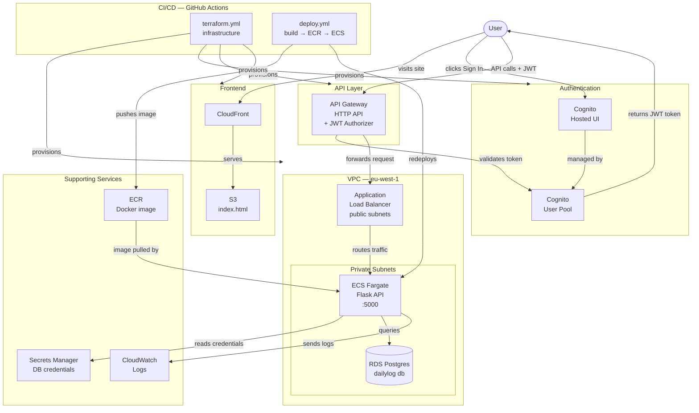

# Daily Log — AWS Containerized Full Stack App

A private daily journal application built on AWS, demonstrating containerized workloads, relational databases, authentication, and infrastructure as code.

> **Live demo:** [CONTACT ME FOR LIVE DEMO]  
> **Portfolio:** [aleksandermatusik.xyz](https://aleksandermatusik.xyz)

---

## Architecture



---

## AWS Services Used

| Service | Purpose |
|---|---|
| **ECS Fargate** | Runs containerized Flask API — no EC2 to manage |
| **ECR** | Private Docker image registry |
| **RDS PostgreSQL** | Relational database for journal entries |
| **Cognito** | User authentication and JWT token issuance |
| **API Gateway** | HTTP API with JWT authorizer — validates every request |
| **ALB** | Routes traffic from API Gateway to ECS tasks |
| **CloudFront** | CDN serving the static frontend globally |
| **S3** | Hosts the static HTML/JS frontend |
| **Secrets Manager** | Stores RDS credentials — never hardcoded |
| **VPC** | Isolated network with public and private subnets |
| **NAT Gateway** | Allows private subnet outbound internet access |
| **CloudWatch** | Container log aggregation |
| **IAM** | Least privilege roles for ECS task execution |
| **ACM** | SSL/TLS certificates for HTTPS |

---

## Key Design Decisions

**Private subnets for compute and data**
ECS tasks and RDS both run in private subnets with no public internet exposure. Only the ALB and NAT Gateway sit in public subnets. Traffic flows inward through API Gateway → ALB → ECS → RDS.

**Secrets Manager over environment variables**
Database credentials are never stored in code, task definitions, or environment variables. The Flask API fetches credentials from Secrets Manager at runtime using the ECS task IAM role.

**API Gateway as the security boundary**
Every request hits API Gateway first. The Cognito JWT authorizer validates tokens before any request reaches the ALB or ECS. Unauthenticated requests are rejected at the edge.

**RDS snapshots for cost-optimised persistence**
The stack is torn down when not in use to avoid ongoing RDS costs. A final snapshot is taken automatically on `terraform destroy` and restored on the next `terraform apply` — data persists across teardowns at near-zero cost.

**Path-filtered CI/CD pipelines**
Two separate GitHub Actions workflows with path filters ensure infrastructure and application deployments are fully independent. Changing app code never triggers a Terraform run and vice versa.

---

## API Endpoints

All endpoints except `/health` require a valid Cognito JWT token in the `Authorization: Bearer <token>` header.

| Method | Endpoint | Description |
|---|---|---|
| `GET` | `/health` | Health check — no auth required |
| `GET` | `/entries` | Get all entries for the authenticated user |
| `POST` | `/entries` | Create a new entry |
| `PUT` | `/entries/:id` | Update an existing entry |
| `DELETE` | `/entries/:id` | Delete an entry |

---

## Infrastructure — Deploy and Destroy

**First deploy:**
```bash
cd terraform
terraform init
terraform apply
```

**Deploy new app version** (handled automatically by CI/CD on push to `/app`):
```bash
git push origin main
```

**Tear down** (snapshot taken automatically before destroy):
```bash
terraform destroy
```

**Restore from snapshot** — update `terraform.tfvars`:
```hcl
snapshot_identifier = "dailylog-final-snapshot"
```
Then run `terraform apply` — RDS restores from snapshot, all data intact.

---

## Local Development

```bash
cd app
pip install -r requirements.txt

# Run locally (health endpoint only — RDS is in private subnet)
flask run --port 5000

# Or with Docker
docker build -t dailylog-api .
docker run -p 5000:5000 -e DB_HOST=placeholder -e DB_NAME=dailylog dailylog-api

curl http://localhost:5000/health
# {"status": "healthy"}
```

---

## CI/CD Pipeline

**terraform.yml** — triggers on changes to `/terraform/**`
```
Push → terraform fmt → terraform validate → terraform plan → terraform apply
```

**deploy.yml** — triggers on changes to `/app/**`
```
Push → docker build → push to ECR → ecs update-service (rolling deploy)
```

Both pipelines authenticate to AWS using **OIDC** — no long-lived AWS credentials stored in GitHub secrets.

---